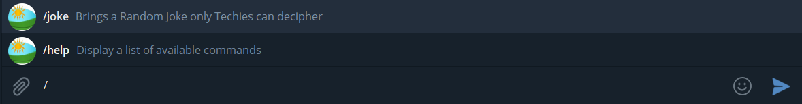

# Project Name: Micronaut Bot

## IMPLEMENTATION OF A TELEGRAM BOT in RUBY

### INTRODUCTION

### RSPEC

## DESCRIPTION & HOW TO START THE BOT

### Start cmd on windows / terminal on mac or linux

- Type below commands to launch the bot
  - Start a new Terminal [CMD from Run/Search on Windows]
  - Clone/Download .zip repo to an easily accesible location by terminal
  - Go to the directory: cd [micronaut-bot]
  - Type: $user-1@[...] [.\bot.rb]
  - Hit Enter/Return and you are live...
  - Continue the below steps to add and USE the telegram bot service
- bot.rb - the entry point file is a command line executable

# USAGE - Instructions

### Search on Telegram for the below name or click

[MicronautBot](t.me/smy5152_bot)

# INTERACTION - Commands

### COMMANDS

- /help : List of Available Commands
- /joke : Gets a random programmer interpretable funny streak to make you smile (I hope...)

## Skills Gained:

- Collaborative learning, being patient, helping each other succeed.
- Self Monitoring & reliable project deliverables on due time, being focused, accountable.
- Ability to work independently and ask for help after due self research when needed.

## Learning Goals:

- Version Control, Git Flow, RSpec Tests
- Application of RUBY Syntax & Programming elements.
- User I/P & O/P via terminal / command line validation and control

## Authors

🧑‍💻 **Shabbir**

- GitHub: [@smy5152](https://github.com/smy5152)
- Twitter: [@smy5152](https://twitter.com/smy5152)
- LinkedIn: [Shabbir Yamani](https://www.linkedin.com/in/shabbirmyamani/)

## Show your support

Give a :star:️ if you like this project!

## Contributing

Bug reports and pull requests are welcome on GitHub at https://github.com/smy5152/micronaut-bot.

## License

The gem is available as open source under the terms of the [MIT License](LICENSE).
