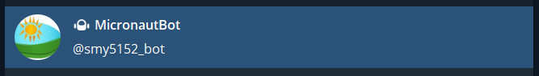
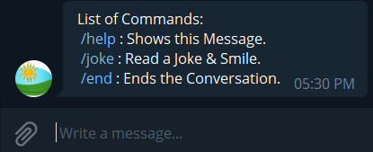
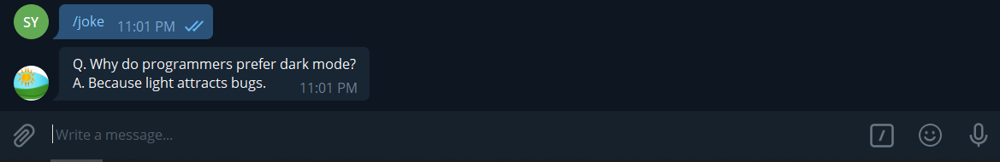
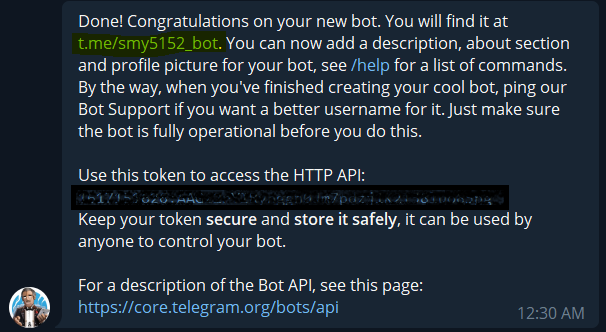
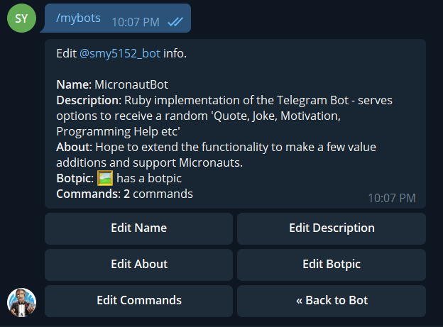

# Project Name: Micronaut Bot

# Introduction

I have delayed building a BOT for fun from a while and finally got around getting this one done in a few hours of overnight coding. The commands are few, extendable to full functionality. I hope to add more contributors and further set of features once its live and available to access from an external server. ( I doubt I can leave my laptop running 24/7 lol :) )

## DESCRIPTION & HOW TO START THE BOT

### The Telegram-bot live link

- Click the link and it will launch The bot in your Desktop Telegram [MicronautBot](t.me/smy5152_bot)
- Search for `MicronautBot` & select the Bot with a Picture of the Sun Shining Bright 

### USAGE - INSTRUCTIONS or COMMANDS

- /help : List of Available Commands
- 
- /joke : Gets a random programmer interpretable funny streak to make you smile (I hope...)
- 
- /end : It stops the bot and says "Bye!".

## IMPLEMENTATION OF A TELEGRAM BOT in RUBY

### BUILT WITH

- [Ruby](https://www.ruby-lang.org/en/)
- [Gems](https://www.ruby-lang.org/en/)
  - [Nokogiri](https://nokogiri.org/)
  - [Rspec](https://rspec.info/)
  - Open-URI
  - Rubocop
  - Dotenv
- VisualStudioCode

## Getting started

- To run the telegram-news-bot you must have Ruby install on your computer. You can downloand and install Ruby from the link below.
- windows [Ruby installer](https://rubyinstaller.org/).
- MAC and LINUX [Ruby official site](https://www.ruby-lang.org/en/downloads/).

## Once Ruby is download and installed, please follow the instructions bellow

### 1- Clone the repo in your local folder where you want to run it

- Run the command below in your terminal
- `git clone https://github.com/smy5152/Micronaut-bot.git`

### 2- Install bundle

- Run `bundle install` to install the gems from the `Gemfile`

### 3- Download telegram and create a bot

- Download the [Telegram app](https://desktop.telegram.org/), create an account.
- Launch [Botfather](https://t.me/botfather). Follow the instructions to create a bot.
- You will then receive an API Token that looks like this: `NUMBER:key`
- Link the token to your bot by creating the .env file in your root directory and then add to token in the variable
  `TELEGRAM_TOKEN = NUMBER:key`

  |                                                      |                                                |
  | :--------------------------------------------------: | :--------------------------------------------: |
  |  |  |

### 4- Run the bot

- Type below commands to launch the bot
  - Start a new Terminal [CMD from Run/Search on Windows]
  - Clone/Download .zip repo to an easily accesible location by terminal
  - Go to the directory: `cd Micronaut-bot`
  - $user-1@[...] `.\main.rb`
  - Hit Enter/Return and your BOT is live...
  - Continue the below steps to add and USE the telegram bot service
- `.\main.rb` - the entry point file is a command line executable
- Alternatively: Run `ruby main.rb` to start the bot.

## Learning Goals:

- Independent learning, focus on end-results and motivating self.
- Progressive Monitoring & reliable project deliverables on due time, being focused, accountable.
- Ability to work independently and ask for help after due self research if needed.
- Version Control, Git Flow, RSpec Tests, Parse URL Feed, BOT Template Implementation
- Application of RUBY Syntax & Programming elements.

## Authors

🧑‍💻 **Shabbir**

- GitHub: [@smy5152](https://github.com/smy5152)
- Twitter: [@smy5152](https://twitter.com/smy5152)
- LinkedIn: [Shabbir Yamani](https://www.linkedin.com/in/shabbirmyamani/)

## Show your support

Give a ⭐️ if you like this project!

### Acknowledgements

- [Microverse]()
- [JOKES-API](https://readme-jokes.vercel.app/api)

## Contributing

Bug reports and pull requests are welcome on GitHub at https://github.com/smy5152/Micronaut-bot.

## License

The gem is available as open source under the terms of the [MIT License](LICENSE).
